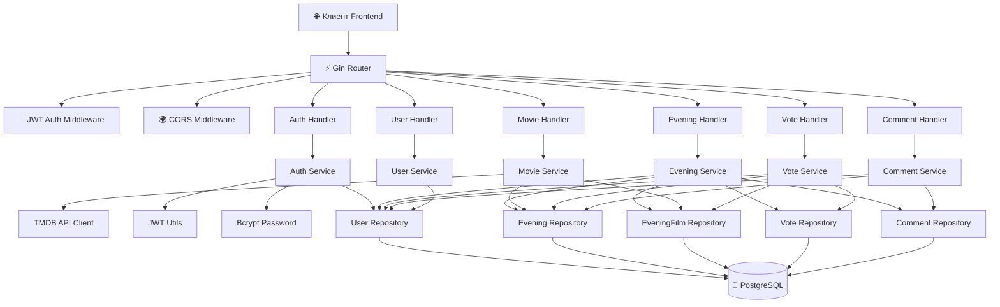
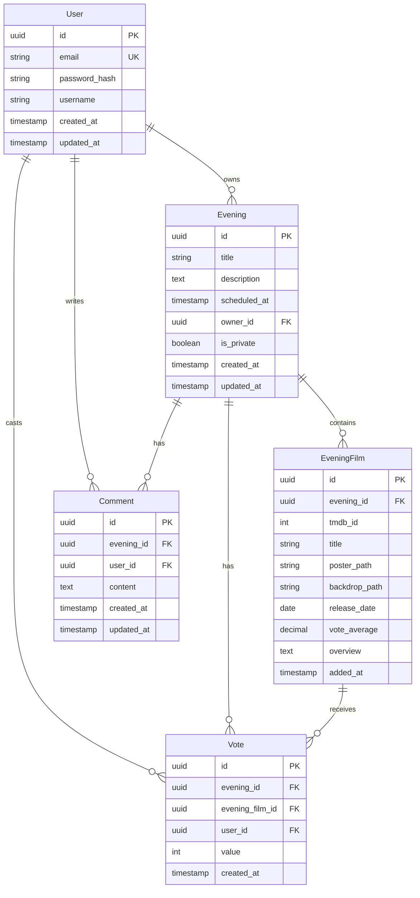

# 🎬 Movie Night Planner Backend

REST API бэкенд для приложения **"Movie Night Planner"** — платформы для планирования киновечеров с возможностью поиска фильмов, голосования и обсуждений.

**Технологии:** Go, PostgreSQL, GORM, Gin, JWT, TMDB API

---

## ✨ Возможности

- **🔐 Аутентификация пользователей** — регистрация, вход, JWT-токены с bcrypt-хэшированием паролей
- **🎥 Управление киновечерами** — создание, редактирование, удаление киновечеров (публичных/приватных)
- **🔍 Поиск фильмов** — интеграция с [TMDB API](https://www.themoviedb.org/) для поиска, популярных фильмов и детальной информации
- **🎬 Добавление фильмов** — привязка фильмов из TMDB к киновечеру
- **⭐️ Голосование** — оценка фильмов по 5-балльной шкале с агрегированной статистикой и распределением голосов
- **💬 Комментарии** — обсуждение киновечеров с привязкой к пользователям
- **👥 Управление пользователями** — просмотр списка пользователей и профилей
- **🔒 Разграничение доступа** — публичные эндпоинты, защищённые маршруты (JWT), опциональная аутентификация
- **🌐 CORS** — поддержка кросс-доменных запросов для фронтенда
- **📄 Логирование** — структурированное логирование HTTP-запросов через Zap
- **🐳 Docker** — контейнеризация API и PostgreSQL

---

## 🗂 Архитектура

Проект следует стандартной **трёхслойной архитектуре** Go-приложений:

```
┌──────────┐     ┌──────────────┐     ┌────────────────┐
│ Handlers │────>│  Services    │────>│  Repositories  │
│ (HTTP)   │     │ (Бизнес-     │     │  (Data Access) │
│          │     │  логика)     │     │                │
└──────────┘     └──────────────┘     └───────┬────────┘
                                              │
                                              ▼
                                       ┌──────────────┐
                                       │  PostgreSQL   │
                                       │  (через GORM) │
                                       └──────────────┘
```

### Схема взаимодействия компонентов



---

## 🚀 Быстрый старт

### Требования

- Go 1.25+
- PostgreSQL 15+ (или Docker)
- TMDB API ключ (бесплатно на [themoviedb.org](https://www.themoviedb.org/settings/api))

### 1. Клонирование

```bash
git clone https://github.com/yourusername/movie-night-planner-backend.git
cd movie-night-planner-backend
```

### 2. Установка зависимостей

```bash
go mod download
```

### 3. Настройка окружения

```bash
cp .env.example .env
```

Отредактируйте [`.env`](.env.example):

```env
# Server
SERVER_PORT=8080
SERVER_MODE=development

# Database
DB_HOST=localhost
DB_PORT=5432
DB_USER=postgres
DB_PASSWORD=postgres
DB_NAME=movie_night_planner
DB_SSLMODE=disable

# JWT
JWT_SECRET=your-super-secret-key-change-in-production
JWT_EXPIRATION=24h

# TMDB API
TMDB_API_KEY=your-tmdb-api-key-here
TMDB_BASE_URL=https://api.themoviedb.org/3
TMDB_IMAGE_BASE_URL=https://image.tmdb.org/t/p

# CORS
CORS_ALLOWED_ORIGINS=http://localhost:3000,http://localhost:5173

# Logging
LOG_LEVEL=debug
LOG_FORMAT=json
```

### 4. Запуск базы данных

**Через Docker (рекомендуется):**

```bash
docker-compose -f docker/docker-compose.yml up -d
```

**Локально:**

```bash
createdb movie_night_planner
```

База данных инициализируется автоматически через GORM AutoMigrate и SQL-миграции (Goose).

### 5. Запуск приложения

```bash
# Локально
go run ./cmd/server

# Через Makefile
make run

# Docker
make docker-build
make docker-run
```

После запуска сервер будет доступен по адресу: `http://localhost:8080`

---

## 📋 API Документация

### Базовый URL

```
http://localhost:8080/api/v1
```

### Эндпоинты

#### 🔐 Аутентификация (публичные)

| Метод | Маршрут | Описание |
|-------|---------|----------|
| `POST` | `/auth/register` | Регистрация нового пользователя |
| `POST` | `/auth/login` | Вход в систему |

#### 🔑 Аутентификация (защищённые)

| Метод | Маршрут | Описание |
|-------|---------|----------|
| `GET` | `/auth/me` | Информация о текущем пользователе |

#### 🎥 Киновечера (публичное чтение, опциональная аутентификация)

| Метод | Маршрут | Описание |
|-------|---------|----------|
| `GET` | `/evenings` | Список киновечеров (с пагинацией: `?page=1&limit=10`) |
| `GET` | `/evenings/:id` | Детали киновечера |
| `GET` | `/evenings/:id/movies` | Фильмы киновечера |
| `GET` | `/evenings/:id/votes` | Голоса киновечера |
| `GET` | `/evenings/:id/comments` | Комментарии киновечера |

#### 🎥 Киновечера (защищённые)

| Метод | Маршрут | Описание |
|-------|---------|----------|
| `POST` | `/evenings` | Создать киновечер |
| `PUT` | `/evenings/:id` | Обновить киновечер |
| `DELETE` | `/evenings/:id` | Удалить киновечер |

#### 🎬 Фильмы (защищённые)

| Метод | Маршрут | Описание |
|-------|---------|----------|
| `POST` | `/evenings/:id/movies` | Добавить фильм в киновечер |
| `DELETE` | `/evenings/:id/movies/:tmdbId` | Удалить фильм из киновечера |
| `POST` | `/evenings/:id/votes` | Проголосовать за фильм |
| `DELETE` | `/evenings/:id/votes/:voteId` | Удалить голос |
| `POST` | `/evenings/:id/comments` | Добавить комментарий |

#### 👥 Пользователи (защищённые)

| Метод | Маршрут | Описание |
|-------|---------|----------|
| `GET` | `/users` | Список пользователей |
| `GET` | `/users/:userId` | Информация о пользователе |

#### 🎞️ Фильмы (публичные)

| Метод | Маршрут | Описание |
|-------|---------|----------|
| `GET` | `/movies/popular` | Популярные фильмы |
| `GET` | `/movies/search` | Поиск фильмов (`?q=back+to+future&page=1`) |
| `GET` | `/movies/:tmdbId` | Детали фильма |

### Примеры запросов

#### Регистрация

```bash
curl -X POST http://localhost:8080/api/v1/auth/register \
  -H "Content-Type: application/json" \
  -d '{"email": "user@example.com", "password": "securePassword123", "username": "john_doe"}'
```

#### Вход

```bash
curl -X POST http://localhost:8080/api/v1/auth/login \
  -H "Content-Type: application/json" \
  -d '{"email": "user@example.com", "password": "securePassword123"}'
```

#### Создание киновечера

```bash
curl -X POST http://localhost:8080/api/v1/evenings \
  -H "Authorization: Bearer <token>" \
  -H "Content-Type: application/json" \
  -d '{"title": "Пятница с пиццей", "description": "Смотрим классические комедии", "scheduled_at": "2026-05-15T20:00:00Z", "is_private": false}'
```

#### Голосование

```bash
curl -X POST http://localhost:8080/api/v1/evenings/<eveningId>/votes \
  -H "Authorization: Bearer <token>" \
  -H "Content-Type: application/json" \
  -d '{"eveningFilmId": "<film-uuid>", "value": 5}'
```

#### Комментирование

```bash
curl -X POST http://localhost:8080/api/v1/evenings/<eveningId>/comments \
  -H "Authorization: Bearer <token>" \
  -H "Content-Type: application/json" \
  -d '{"content": "Давайте смотреть в 20:00!"}'
```

---

## 🗄 Модели данных



**Связи:**
- **User** 1→М **Evening** — пользователь создаёт киновечера
- **User** 1→М **Vote** — пользователь голосует
- **User** 1→М **Comment** — пользователь комментирует
- **Evening** 1→М **EveningFilm** — киновечер содержит фильмы
- **Evening** 1→М **Vote** — киновечер имеет голоса
- **Evening** 1→М **Comment** — киновечер имеет комментарии
- **Vote** оценивает фильм в рамках киновечера (уникальность: `evening_id + evening_film_id + user_id`)

---

## 📁 Структура проекта

```
movie-night-planner-backend/
├── cmd/
│   ├── server/
│   │   └── main.go                      # Точка входа, инициализация и роутинг
│   └── migrate-cli/
│       ├── main.go                      # CLI для миграций (Goose)
│       └── create.go                    # Генератор новых миграций
│
├── internal/
│   ├── config/
│   │   ├── config.go                    # Загрузка конфигурации из .env
│   │   └── config_test.go               # Тесты конфигурации
│   │
│   ├── database/
│   │   └── database.go                  # Подключение к PostgreSQL через GORM, AutoMigrate
│   │
│   ├── models/
│   │   └── models.go                    # Модели: User, Evening, EveningFilm, Vote, Comment
│   │
│   ├── repositories/                    # Слой доступа к данным (Data Access Layer)
│   │   ├── user_repository.go           #   CRUD пользователей
│   │   ├── evening_repository.go        #   CRUD киновечеров с пагинацией и фильтрацией
│   │   ├── evening_film_repository.go    #   CRUD фильмов киновечера
│   │   ├── vote_repository.go           #   CRUD голосов
│   │   └── comment_repository.go        #   CRUD комментариев
│   │
│   ├── services/                        # Бизнес-логика (Service Layer)
│   │   ├── auth_service.go              #   Регистрация, вход, JWT-токены
│   │   ├── evening_service.go           #   Управление киновечерами
│   │   ├── movie_service.go             #   TMDB интеграция, добавление/удаление фильмов
│   │   ├── vote_service.go              #   Голосование и агрегация статистики
│   │   ├── comment_service.go           #   Комментарии
│   │   └── user_service.go              #   Пользователи (список, профиль)
│   │
│   ├── handlers/                        # HTTP-хендлеры (Presentation Layer)
│   │   ├── auth_handler.go              #   POST /register, /login, GET /me
│   │   ├── evening_handler.go           #   CRUD киновечеров
│   │   ├── movie_handler.go             #   Поиск, популярные, детали фильмов
│   │   ├── vote_handler.go              #   Голосование
│   │   ├── comment_handler.go           #   Комментарии
│   │   └── user_handler.go              #   Список и профили пользователей
│   │
│   ├── middleware/                      # Промежуточные слои
│   │   ├── auth.go                      #   JWT-аутентификация (обязательная и опциональная)
│   │   ├── cors.go                      #   CORS-политика
│   │   └── logging.go                   #   Логирование HTTP-запросов (Zap)
│   │
│   ├── tmdb/
│   │   └── client.go                    # HTTP-клиент для TMDB API v3
│   │
│   └── utils/
│       ├── jwt.go                       # Генерация и валидация JWT-токенов
│       ├── jwt_test.go                  #   Тесты JWT
│       ├── password.go                  # Хэширование и проверка паролей (bcrypt)
│       └── errors.go                    # Кастомные ошибки и обёртки
│
├── pkg/
│   └── response/
│       └── response.go                  # Общие типы ответов API (PaginatedResponse, ErrorResponse)
│
├── migrations/                          # SQL-миграции (Goose)
│   ├── 001_create_users_table.sql
│   ├── 002_create_evenings_table.sql
│   ├── 003_create_evening_films_table.sql
│   ├── 004_create_votes_table.sql
│   └── 005_create_comments_table.sql
│
├── docker/
│   ├── Dockerfile                       # Многоступенчатая сборка (golang:1.21-alpine → alpine)
│   └── docker-compose.yml              # API + PostgreSQL 15 с healthcheck
│
├── .env.example                         # Шаблон переменных окружения
├── .golangci.yml                        # Конфигурация линтера
├── go.mod / go.sum                      # Модульные зависимости
├── Makefile                             # Команды сборки, запуска, тестов, миграций
└── README.md
```

---

## 🐳 Docker

### Сборка и запуск

```bash
# Сборка образа
make docker-build

# Запуск (API + PostgreSQL)
make docker-run

# Остановка
make docker-stop

# Логи
make docker-logs
```

**docker-compose.yml** включает два сервиса:
- **api** — приложение на Go (порт `8080`), зависит от PostgreSQL, использует healthcheck
- **postgres** — PostgreSQL 15-alpine (порт `5432`), с постоянным томом для данных

---

## 🛠 Makefile

| Команда | Описание |
|---------|----------|
| `make build` | Сборка бинарника |
| `make run` | Запуск в режиме разработки |
| `make test` | Запуск тестов с покрытием |
| `make test-race` | Тесты с детектором гонок |
| `make lint` | Линтинг кода (golangci-lint) |
| `make fmt` | Форматирование кода |
| `make clean` | Очистка артефактов |
| `make docker-build` | Сборка Docker-образа |
| `make docker-run` | Запуск Docker Compose |
| `make docker-stop` | Остановка Docker Compose |
| `make docker-logs` | Просмотр логов Docker |
| `make migrate-up` | Накатить миграции |
| `make migrate-down` | Откатить миграции |
| `make migrate-create` | Создать новую миграцию |

---

## 🧪 Тестирование

```bash
# Запуск всех тестов
make test

# Тесты с детектором гонок
make test-race
```

Проект содержит тесты для:
- [`utils/jwt_test.go`](internal/utils/jwt_test.go) — генерация и валидация JWT-токенов
- [`config/config_test.go`](internal/config/config_test.go) — загрузка конфигурации

---

## 🧰 Используемые технологии

| Компонент | Технология |
|-----------|-----------|
| **Язык** | Go 1.25 |
| **Веб-фреймворк** | [Gin](https://github.com/gin-gonic/gin) |
| **ORM** | [GORM](https://gorm.io/) с драйвером PostgreSQL |
| **База данных** | PostgreSQL 15+ |
| **Аутентификация** | JWT (HS256) через [golang-jwt](https://github.com/golang-jwt/jwt) |
| **Пароли** | bcrypt ([golang.org/x/crypto](https://pkg.go.dev/golang.org/x/crypto)) |
| **Миграции** | [Goose](https://github.com/pressly/goose) + [golang-migrate](https://github.com/golang-migrate/migrate) |
| **Логирование** | [Zap](https://github.com/uber-go/zap) |
| **Внешнее API** | [TMDB API v3](https://developers.themoviedb.org/3) |
| **ID** | UUID ([google/uuid](https://github.com/google/uuid)) |
| **Конфигурация** | godotenv ([.env](.env.example)) |
| **Контейнеризация** | Docker + Docker Compose |
| **CI/линтер** | [golangci-lint](.golangci.yml) |

---

## 📄 Лицензия

Проект распространяется под лицензией MIT. См. файл [LICENSE](LICENSE).
