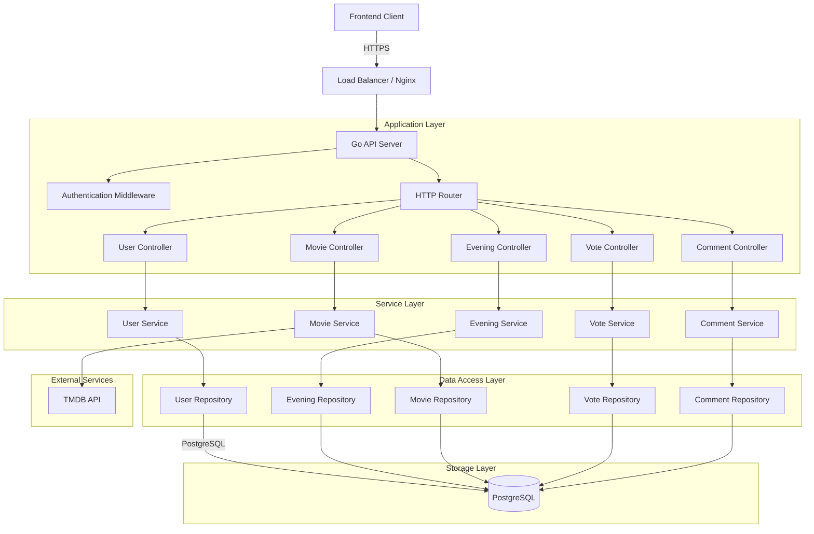

# Movie Night Planner - Backend Architecture

## 1. Overview

Backend API для приложения "Movie Night Planner" (Планировщик кинопросмотра) на Go с PostgreSQL и JWT аутентификацией.

### Key Features
- REST API для управления киновечерами, фильмами, голосами и комментариями
- JWT аутентификация пользователей
- Интеграция с TMDB API для поиска фильмов и получения информации
- PostgreSQL для хранения данных
- Docker support для деплоя

## 2. System Architecture



## 3. Database Schema

### 3.1 Users Table

```sql
CREATE TABLE users (
    id UUID PRIMARY KEY DEFAULT gen_random_uuid(),
    email VARCHAR(255) UNIQUE NOT NULL,
    password_hash VARCHAR(255) NOT NULL,
    username VARCHAR(100) NOT NULL,
    created_at TIMESTAMP WITH TIME ZONE DEFAULT CURRENT_TIMESTAMP,
    updated_at TIMESTAMP WITH TIME ZONE DEFAULT CURRENT_TIMESTAMP
);

CREATE INDEX idx_users_email ON users(email);
```

### 3.2 Evenings Table

```sql
CREATE TABLE evenings (
    id UUID PRIMARY KEY DEFAULT gen_random_uuid(),
    title VARCHAR(255) NOT NULL,
    description TEXT,
    scheduled_at TIMESTAMP WITH TIME ZONE,
    owner_id UUID NOT NULL REFERENCES users(id) ON DELETE CASCADE,
    is_private BOOLEAN DEFAULT FALSE,
    created_at TIMESTAMP WITH TIME ZONE DEFAULT CURRENT_TIMESTAMP,
    updated_at TIMESTAMP WITH TIME ZONE DEFAULT CURRENT_TIMESTAMP
);

CREATE INDEX idx_evenings_owner_id ON evenings(owner_id);
CREATE INDEX idx_evenings_scheduled_at ON evenings(scheduled_at);
```

### 3.3 Evening_Films Table (Many-to-Many)

```sql
CREATE TABLE evening_films (
    id UUID PRIMARY KEY DEFAULT gen_random_uuid(),
    evening_id UUID NOT NULL REFERENCES evenings(id) ON DELETE CASCADE,
    tmdb_id INTEGER NOT NULL,
    title VARCHAR(255) NOT NULL,
    poster_path VARCHAR(255),
    backdrop_path VARCHAR(255),
    release_date DATE,
    vote_average DECIMAL(3,1),
    overview TEXT,
    added_at TIMESTAMP WITH TIME ZONE DEFAULT CURRENT_TIMESTAMP,
    UNIQUE(evening_id, tmdb_id)
);

CREATE INDEX idx_evening_films_evening_id ON evening_films(evening_id);
CREATE INDEX idx_evening_films_tmdb_id ON evening_films(tmdb_id);
```

### 3.4 Votes Table

```sql
CREATE TABLE votes (
    id UUID PRIMARY KEY DEFAULT gen_random_uuid(),
    evening_id UUID NOT NULL REFERENCES evenings(id) ON DELETE CASCADE,
    evening_film_id UUID NOT NULL REFERENCES evening_films(id) ON DELETE CASCADE,
    user_id UUID NOT NULL REFERENCES users(id) ON DELETE CASCADE,
    value INTEGER NOT NULL CHECK (value >= 1 AND value <= 5),
    created_at TIMESTAMP WITH TIME ZONE DEFAULT CURRENT_TIMESTAMP,
    UNIQUE(evening_id, evening_film_id, user_id)
);

CREATE INDEX idx_votes_evening_id ON votes(evening_id);
CREATE INDEX idx_votes_user_id ON votes(user_id);
CREATE INDEX idx_votes_evening_film_id ON votes(evening_film_id);
```

### 3.5 Comments Table

```sql
CREATE TABLE comments (
    id UUID PRIMARY KEY DEFAULT gen_random_uuid(),
    evening_id UUID NOT NULL REFERENCES evenings(id) ON DELETE CASCADE,
    user_id UUID NOT NULL REFERENCES users(id) ON DELETE CASCADE,
    content TEXT NOT NULL,
    created_at TIMESTAMP WITH TIME ZONE DEFAULT CURRENT_TIMESTAMP,
    updated_at TIMESTAMP WITH TIME ZONE DEFAULT CURRENT_TIMESTAMP
);

CREATE INDEX idx_comments_evening_id ON comments(evening_id);
CREATE INDEX idx_comments_user_id ON comments(user_id);
```

## 4. API Endpoints

### 4.1 Authentication

| Method | Endpoint | Description | Auth Required |
|--------|----------|-------------|---------------|
| POST | `/api/auth/register` | Регистрация пользователя | No |
| POST | `/api/auth/login` | Вход пользователя | No |
| GET | `/api/auth/me` | Получение текущей информации о пользователе | Yes |

**Request/Response Examples:**

```json
// POST /api/auth/register
{
  "email": "user@example.com",
  "password": "securePassword123",
  "username": "john_doe"
}

// Response 201 Created
{
  "id": "uuid",
  "email": "user@example.com",
  "username": "john_doe",
  "created_at": "2026-05-09T12:00:00Z"
}

// POST /api/auth/login
{
  "email": "user@example.com",
  "password": "securePassword123"
}

// Response 200 OK
{
  "access_token": "jwt_token_here",
  "refresh_token": "refresh_token_here",
  "expires_in": 3600
}
```

### 4.2 Users

| Method | Endpoint | Description | Auth Required |
|--------|----------|-------------|---------------|
| GET | `/api/users/:id` | Получение информации о пользователе | No |
| GET | `/api/users/:id/evenings` | Получение киновечеров пользователя | No |

### 4.3 Evenings

| Method | Endpoint | Description | Auth Required |
|--------|----------|-------------|---------------|
| GET | `/api/evenings` | Получение списка киновечеров | No |
| GET | `/api/evenings/:id` | Получение информации о киновечере | No |
| POST | `/api/evenings` | Создание нового киновечера | Yes |
| PUT | `/api/evenings/:id` | Обновление киновечера | Yes (owner) |
| DELETE | `/api/evenings/:id` | Удаление киновечера | Yes (owner) |
| GET | `/api/evenings/:id/participants` | Получение участников вечера | No |

**Request/Response Examples:**

```json
// POST /api/evenings
{
  "title": "Пятница с пиццей",
  "description": "Смотрим классические комедии",
  "scheduled_at": "2026-05-15T20:00:00Z",
  "is_private": false
}

// Response 201 Created
{
  "id": "uuid",
  "title": "Пятница с пиццей",
  "description": "Смотрим классические комедии",
  "scheduled_at": "2026-05-15T20:00:00Z",
  "owner_id": "uuid",
  "is_private": false,
  "created_at": "2026-05-09T12:00:00Z",
  "updated_at": "2026-05-09T12:00:00Z"
}

// GET /api/evenings?status=upcoming&page=1&limit=10
// Response 200 OK
{
  "data": [...],
  "pagination": {
    "page": 1,
    "limit": 10,
    "total": 50,
    "total_pages": 5
  }
}
```

### 4.4 Movies (TMDB Integration)

| Method | Endpoint | Description | Auth Required |
|--------|----------|-------------|---------------|
| GET | `/api/movies/search` | Поиск фильмов в TMDB | No |
| GET | `/api/movies/:tmdbId` | Получение информации о фильме | No |
| POST | `/api/movies/:tmdbId/evenings/:eveningId` | Добавление фильма в вечер | Yes |
| DELETE | `/api/movies/:tmdbId/evenings/:eveningId` | Удаление фильма из вечера | Yes (owner) |

**Request/Response Examples:**

```json
// GET /api/movies/search?q=back+to+future&page=1
// Response 200 OK
{
  "data": [
    {
      "tmdb_id": 105,
      "title": "Back to the Future",
      "poster_path": "/fNOH9f1aD75449E472f847f5D4D.jpg",
      "backdrop_path": "/7lyBcpYB0Qt8gYhXYaXDnDQf93l.jpg",
      "release_date": "1985-07-03",
      "vote_average": 8.3,
      "overview": "Marty McFly, a 17-year-old high school student, is accidentally sent thirty years into the past in a time-traveling DeLorean..."
    }
  ],
  "pagination": {
    "page": 1,
    "total_pages": 10,
    "total_results": 100
  }
}
```

### 4.5 Votes

| Method | Endpoint | Description | Auth Required |
|--------|----------|-------------|---------------|
| GET | `/api/evenings/:id/votes` | Получение голосов для вечера | No |
| POST | `/api/evenings/:id/votes` | Голосование за фильм | Yes |
| DELETE | `/api/evenings/:id/votes/:eveningFilmId` | Удаление голоса | Yes |

**Request/Response Examples:**

```json
// POST /api/evenings/:id/votes
{
  "evening_film_id": "uuid",
  "value": 5
}

// Response 201 Created
{
  "id": "uuid",
  "evening_id": "uuid",
  "evening_film_id": "uuid",
  "user_id": "uuid",
  "value": 5,
  "created_at": "2026-05-09T12:00:00Z"
}

// GET /api/evenings/:id/votes
// Response 200 OK
{
  "data": [
    {
      "evening_film_id": "uuid",
      "title": "Back to the Future",
      "poster_path": "/fNOH9f1aD75449E472f847f5D4D.jpg",
      "total_votes": 15,
      "average_score": 4.2,
      "vote_distribution": {
        "1": 1,
        "2": 2,
        "3": 3,
        "4": 4,
        "5": 5
      }
    }
  ]
}
```

### 4.6 Comments

| Method | Endpoint | Description | Auth Required |
|--------|----------|-------------|---------------|
| GET | `/api/evenings/:id/comments` | Получение комментариев вечера | No |
| POST | `/api/evenings/:id/comments` | Добавление комментария | Yes |
| PUT | `/api/comments/:id` | Обновление комментария | Yes (owner) |
| DELETE | `/api/comments/:id` | Удаление комментария | Yes (owner) |

**Request/Response Examples:**

```json
// POST /api/evenings/:id/comments
{
  "content": "Давайте смотреть в 20:00!"
}

// Response 201 Created
{
  "id": "uuid",
  "evening_id": "uuid",
  "user_id": "uuid",
  "username": "john_doe",
  "content": "Давайте смотреть в 20:00!",
  "created_at": "2026-05-09T12:00:00Z"
}

// GET /api/evenings/:id/comments
// Response 200 OK
{
  "data": [
    {
      "id": "uuid",
      "user_id": "uuid",
      "username": "john_doe",
      "content": "Давайте смотреть в 20:00!",
      "created_at": "2026-05-09T12:00:00Z"
    }
  ]
}
```

## 5. Project Structure

```
movie-night-planner-backend/
├── cmd/
│   └── server/
│       └── main.go              # Application entry point
├── internal/
│   ├── config/
│   │   └── config.go            # Configuration management
│   ├── database/
│   │   └── database.go          # Database connection
│   ├── models/
│   │   ├── user.go              # User model
│   │   ├── evening.go           # Evening model
│   │   ├── evening_film.go      # EveningFilm model
│   │   ├── vote.go              # Vote model
│   │   └── comment.go           # Comment model
│   ├── repositories/
│   │   ├── user_repository.go   # User database operations
│   │   ├── evening_repository.go
│   │   ├── evening_film_repository.go
│   │   ├── vote_repository.go
│   │   └── comment_repository.go
│   ├── services/
│   │   ├── auth_service.go      # Authentication logic
│   │   ├── user_service.go
│   │   ├── evening_service.go
│   │   ├── movie_service.go     # TMDB integration
│   │   ├── vote_service.go
│   │   └── comment_service.go
│   ├── handlers/
│   │   ├── auth_handler.go      # HTTP handlers for auth
│   │   ├── user_handler.go
│   │   ├── evening_handler.go
│   │   ├── movie_handler.go
│   │   ├── vote_handler.go
│   │   └── comment_handler.go
│   ├── middleware/
│   │   ├── auth.go              # JWT authentication middleware
│   │   ├── cors.go              # CORS middleware
│   │   ├── logging.go           # Logging middleware
│   │   └── validation.go        # Request validation middleware
│   ├── utils/
│   │   ├── jwt.go               # JWT token generation/verification
│   │   ├── password.go          # Password hashing
│   │   └── errors.go            # Custom error types
│   └── tmdb/
│       └── client.go            # TMDB API client
├── migrations/
│   ├── 001_create_users_table.sql
│   ├── 002_create_evenings_table.sql
│   ├── 003_create_evening_films_table.sql
│   ├── 004_create_votes_table.sql
│   └── 005_create_comments_table.sql
├── pkg/
│   └── response/
│       └── response.go          # Common response helpers
├── tests/
│   ├── integration/
│   │   ├── auth_test.go
│   │   ├── evening_test.go
│   │   ├── movie_test.go
│   │   ├── vote_test.go
│   │   └── comment_test.go
│   └── fixtures/
│       └── fixtures.go          # Test data fixtures
├── docker/
│   ├── Dockerfile
│   └── docker-compose.yml
├── .env.example                 # Environment variables template
├── .golangci.yml                # Golangci-lint configuration
├── .pre-commit-config.yaml      # Pre-commit hooks
├── Makefile                     # Build automation
├── go.mod
├── go.sum
└── README.md
```

## 6. Technology Stack

### Backend Framework
- **Gin** - High-performance HTTP web framework
- **GORM** - ORM for PostgreSQL
- **Viper** - Configuration management
- **Go-Zap** - Structured logging

### Authentication
- **Golang-JWT** - JWT token management
- **Bcrypt** - Password hashing

### Database
- **PostgreSQL 15+** - Primary database
- **Golang-Migrate** - Database migrations

### Testing
- **Testify** - Testing assertions and mocks
- **Gomock** - Mock generation
- **Ginkgo** - BDD-style testing (optional)

### API Documentation
- **Swaggo** - OpenAPI/Swagger documentation

### DevOps
- **Docker** - Containerization
- **Docker Compose** - Local development environment
- **GitHub Actions** - CI/CD pipeline

## 7. Environment Variables

```env
# Server
SERVER_PORT=8080
SERVER_MODE=development

# Database
DB_HOST=localhost
DB_PORT=5432
DB_USER=postgres
DB_PASSWORD=postgres
DB_NAME=movie_night_planner
DB_SSLMODE=disable

# JWT
JWT_SECRET=your-secret-key-here
JWT_EXPIRATION=24h

# TMDB API
TMDB_API_KEY=your-tmdb-api-key
TMDB_BASE_URL=https://api.themoviedb.org/3
TMDB_IMAGE_BASE_URL=https://image.tmdb.org/t/p

# CORS
CORS_ALLOWED_ORIGINS=http://localhost:3000,http://localhost:5173

# Logging
LOG_LEVEL=debug
LOG_FORMAT=json
```

## 8. Error Handling

### Custom Error Types

```go
type AppError struct {
    Code    string `json:"code"`
    Message string `json:"message"`
    Err     error  `json:"-"`
}

// Error codes
const (
    ErrInvalidRequest     = "INVALID_REQUEST"
    ErrUnauthorized       = "UNAUTHORIZED"
    ErrForbidden          = "FORBIDDEN"
    ErrNotFound           = "NOT_FOUND"
    ErrConflict           = "CONFLICT"
    ErrInternalServer     = "INTERNAL_SERVER_ERROR"
    ErrValidation         = "VALIDATION_ERROR"
    ErrExternalAPI        = "EXTERNAL_API_ERROR"
)
```

### Error Response Format

```json
{
  "error": {
    "code": "VALIDATION_ERROR",
    "message": "Invalid input: email is required",
    "details": [
      {
        "field": "email",
        "message": "is required"
      }
    ]
  }
}
```

## 9. Security Considerations

1. **Password Hashing**: Bcrypt with cost factor 12
2. **JWT Tokens**: Access token (15 min) + Refresh token (7 days)
3. **SQL Injection Prevention**: GORM parameterized queries
4. **XSS Prevention**: Input sanitization
5. **CORS**: Configured for specific origins
6. **Rate Limiting**: Implemented via middleware
7. **HTTPS**: Required for production

## 10. Performance Considerations

1. **Database Indexing**: Proper indexes on foreign keys and frequently queried fields
2. **Connection Pooling**: Configured GORM connection pool
3. **Caching**: Redis caching for TMDB responses (optional)
4. **Pagination**: Implemented for list endpoints
5. **Lazy Loading**: GORM preloading for associations

## 11. Testing Strategy

### Unit Tests
- Service layer logic
- Repository layer operations
- Utility functions (JWT, password hashing)

### Integration Tests
- API endpoints with test database
- External API mocking (TMDB)
- Transaction rollback for test isolation

### Test Coverage Target: 80%+

## 12. CI/CD Pipeline

### GitHub Actions Workflow

```yaml
name: CI/CD

on:
  push:
    branches: [main, develop]
  pull_request:
    branches: [main]

jobs:
  test:
    runs-on: ubuntu-latest
    services:
      postgres:
        image: postgres:15
        env:
          POSTGRES_PASSWORD: postgres
          POSTGRES_DB: test_db
        options: >-
          --health-cmd pg_isready
          --health-interval 10s
          --health-timeout 5s
          --health-retries 5
    steps:
      - uses: actions/checkout@v3
      - uses: actions/setup-go@v4
        with:
          go-version: '1.21'
      - name: Run tests
        run: make test
      - name: Upload coverage
        uses: codecov/codecov-action@v3

  lint:
    runs-on: ubuntu-latest
    steps:
      - uses: actions/checkout@v3
      - uses: actions/setup-go@v4
      - name: Run golangci-lint
        run: make lint

  build:
    needs: [test, lint]
    runs-on: ubuntu-latest
    steps:
      - uses: actions/checkout@v3
      - name: Build Docker image
        run: docker build -t movie-night-planner:latest .

  deploy:
    needs: build
    runs-on: ubuntu-latest
    if: github.ref == 'refs/heads/main'
    steps:
      - name: Deploy to production
        run: echo "Deploy to production"
```

## 13. API Versioning

API versioning via URL path: `/api/v1/...`

Future versions: `/api/v2/...`

## 14. Monitoring and Observability

1. **Logging**: Structured JSON logs with correlation IDs
2. **Health Check**: `/health` endpoint
3. **Metrics**: Prometheus metrics (optional)
4. **Tracing**: OpenTelemetry (optional)

## 15. Future Enhancements

1. WebSocket support for real-time updates
2. Email notifications for upcoming evenings
3. File upload for custom posters
4. Recommendation engine based on voting patterns
5. Social features (friends, sharing)
6. Mobile push notifications
